<h3 style="padding-top:0px; color: #0077aa;" align="center">🔥 Languages & Tools & Frameworks & Abilities 🔥</h3>

  <code></code>
  <code></code>
  <code></code>
  <code></code>
  <code></code>
  <code></code> 
  <code></code> 
   
  <code>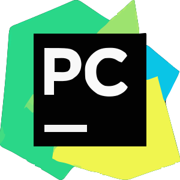</code>
  <code></code>
  <code></code> 
  <code></code>
  <code>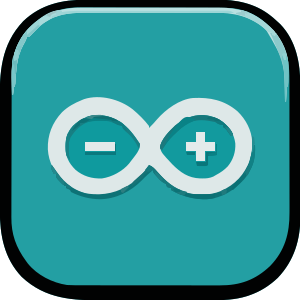</code>
  <code>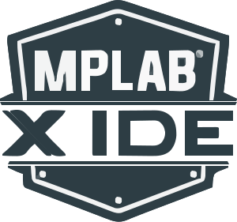</code>  
  <code>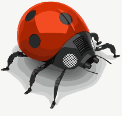</code>
  <code></code>
  <code></code> 
  <code>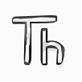</code>
  <code>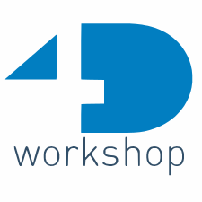</code>
  &nbsp; &nbsp; 
  <code></code>
  <code></code> 
  <code></code>  
   
  <code></code>
  <code>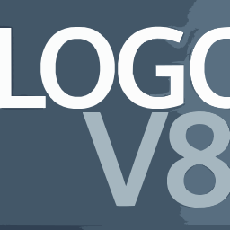</code>
  <code>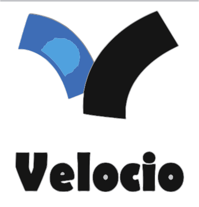</code>
  &nbsp; &nbsp;
  <code>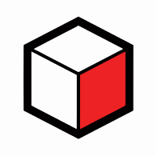</code>
  &nbsp; &nbsp;
  <code>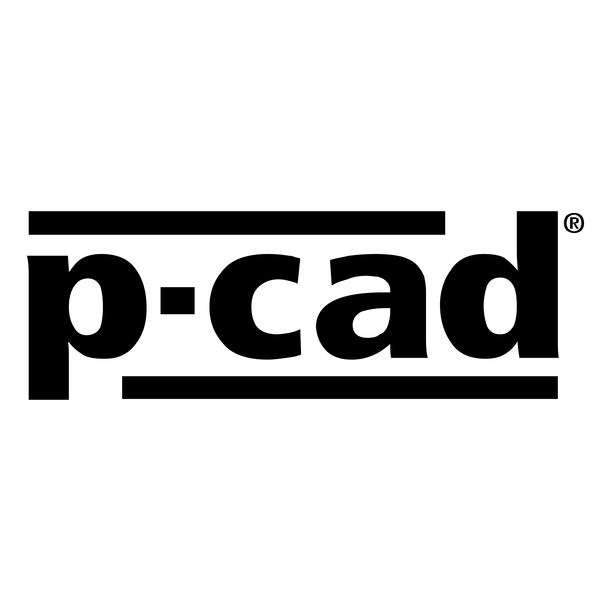</code> 
  <code>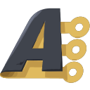</code>
  <code></code>
   
  <code>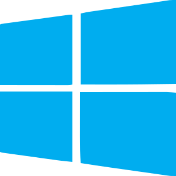</code>
  <code>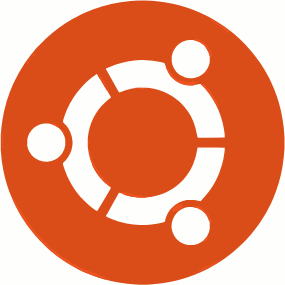</code>
  <code>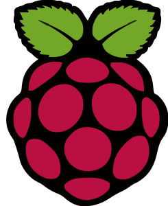</code>
  &nbsp; &nbsp; 
  <code>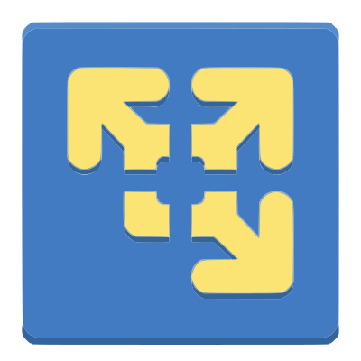</code>
  <code>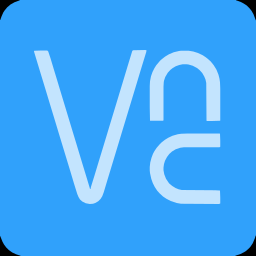</code> 

<a>
  ✨ <b>Frequently Used Hardware Components:</b> 
  ⚡ MCU-8bit: PIC18F18K22, PIC18F27K42, PIC18F45K22, PIC18F47Q84, PIC18F57K42,... 
  ⚡ MCU-32bit: ESP8266, ESP32, LPC1768, ...  
  ⚡ SBC: RPI Zero(W), RPI 3B, RPI 4B, RPI 5, Pico  
  ⚡ PLC: Siemens S71200, S71500, LOGO8.
</a>
<h3 align="center" style="padding: 0;">
</h3>
<!--
**rcx-t/rcx-t** is a ✨ _special_ ✨ repository because its `README.md` (this file) appears on your GitHub profile.

Here are some ideas to get you started:

- 🔭 I’m currently working on ...
- 🌱 I’m currently learning ...
- 👯 I’m looking to collaborate on ...
- 🤔 I’m looking for help with ...
- 💬 Ask me about ...
- 📫 How to reach me: ...
- 😄 Pronouns: ...
- ⚡ Fun fact: ...
-->